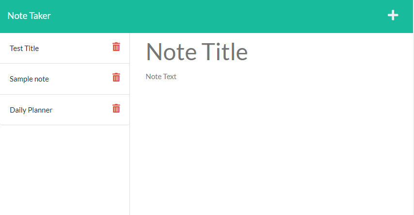

# Note Taker App

## Description

This application refactors pre-existing front-end note application code to run using an express server in the backend. Express was used to create listeners for get and post requests and sending back appropriate information. The application was also deploye to a live link using Heroku.

## Table of Contents

- [Installation](#installation)
- [Technologies](#technologies)
- [Deployed Site](#deployed%20site)
- [Contact Information](#contact%20information)
- [License](#license)

## Installation/Usage

To run the following repository on a local machine:

``` terminal
git clone "ssh key"
npm install
npm start
open webbrowser and go to localhost:3001
```

An updated live link is also available to see the site:

[Live Site Link](https://note-taker-hmanjun.herokuapp.com/)

## Technologies

- HTML
- CSS
- JavaScript
- Node.js
- Express.js
- path package
- file system package
- Heroku

## Deployed Site



[Live Site Link](https://note-taker-hmanjun.herokuapp.com/)

## Contact Information

[Github](https://github.com/hmanjun) |
[Email](hmanjun@ucsc.edu) 

## License

This repo is licensed by MIT

[](https://opensource.org/licenses/MIT)